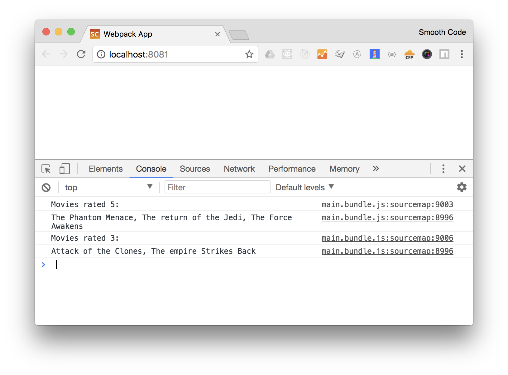

# Exercice 9 - Webpack

## Instructions

Nous souhaitons faire fonctionner notre projet sur le web. Pour cela nous allons le bundler avec Webpack.

* Installer `webpack`, `webpack-cli`, `webpack-dev-server`, `html-webpack-plugin` et `babel-loader`
* Créer un fichier `webpack.config.js` avec la configuration suivante :

```js
// webpack.config.js
const path = require('path')
const HtmlWebpackPlugin = require('html-webpack-plugin')

module.exports = {
  entry: './main.js',
  output: {
    path: path.resolve(__dirname, 'dist'),
    filename: 'main.bundle.js',
  },
  module: {
    rules: [
      {
        test: /\.js$/,
        use: 'babel-loader',
      },
    ],
  },
  plugins: [new HtmlWebpackPlugin()],
}
```

* Modifier le fichier `.babelrc` afin de désactiver la transformation des modules
* Ajouter un script npm "dev" qui lancera `webpack-dev-server`
* Lancer `npm run dev`

**Résultat attendu**

```
$ npm run dev
Project is running at http://localhost:8081/
```



## Aide

### Désactivation de la transpilation des modules dans `.babelrc`

```json
{
  "presets": [
    [
      "env",
      {
        "modules": false
      }
    ]
  ]
}
```
